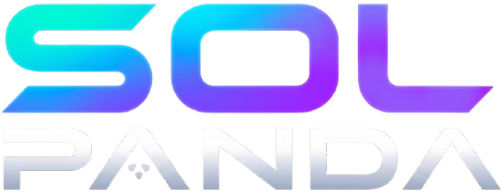

# 🐼 SOL PANDA — Solana Community Acceleration & Growth Agency

<div align="center">

  

  <p align="center">
    <strong>The Premier Community Growth, Raiding, and Moderation Force on Solana.</strong>
  </p>

  <p align="center">
    <a href="https://x.com/sol_panda1"></a>
    <a href="https://t.me/solpandaa001"></a>
    <a href="https://t.me/Sol_pandaa"></a>
    <a href="https://solana.com"></a>
  </p>

  <p align="center">
    
    
    
    
    
    
  </p>

</div>

---

## 🌟 Overview

**SOL PANDA** is a high-impact Web3 growth and community acceleration powerhouse built exclusively for the **Solana ecosystem**. Whether a project requires dedicated single-operator management, 24/7 spam-free moderation, aggressive viral shilling, or a coordinated 50+ raider army, Sol Panda delivers execution, engagement, and verified proof of work.

---

## 🚀 Key Sections & Architecture

<table align="center" width="100%">
  <tr>
    <td width="50%" valign="top">
      <h3>1. 🧭 Navigation & Brand Lockup</h3>
      <ul>
        <li>Official Solana icon badge with live neon pulse.</li>
        <li>Custom <code>SOL PANDA</code> hero emblem typography.</li>
        <li>Instant <code>LET'S TALK</code> direct Telegram access.</li>
      </ul>
    </td>
    <td width="50%" valign="top">
      <h3>2. ⚡ Hero Section</h3>
      <ul>
        <li>Full-bleed immersive cyberpunk universe visual.</li>
        <li>Capabilities status tags and proof-of-work indicators.</li>
        <li>Direct access to the Panda Network channel.</li>
      </ul>
    </td>
  </tr>
  <tr>
    <td width="50%" valign="top">
      <h3>3. 🛠️ Services Section (2x3 Grid)</h3>
      <ul>
        <li><strong>Community Management:</strong> Active, welcoming, and organized channels.</li>
        <li><strong>Moderation:</strong> 24/7 anti-spam and positive sentiment protection.</li>
        <li><strong>Raid Management:</strong> Real engagement and viral momentum.</li>
        <li><strong>Shilling:</strong> High-impact narrative distribution.</li>
        <li><strong>Growth Strategy:</strong> Data-driven holder conversion.</li>
        <li><strong>Community Growth:</strong> Turning audiences into long-term believers.</li>
        <li><em>Continuous rotating Solana color gradient borders.</em></li>
      </ul>
    </td>
    <td width="50%" valign="top">
      <h3>4. 🥷 Coordinated Raider Team</h3>
      <ul>
        <li>Authentic tilted polaroid panda artwork.</li>
        <li>50+ Verified raider army metrics.</li>
        <li>Graffiti slogan: <code>MORE HANDS BIGGER IMPACT</code>.</li>
        <li>One-click campaign execution booking.</li>
      </ul>
    </td>
  </tr>
  <tr>
    <td width="50%" valign="top">
      <h3>5. 💎 Simple Packages</h3>
      <ul>
        <li><strong>Individual Support ($100 / Week):</strong> Dedicated personal Web3 operator.</li>
        <li><strong>Massive Raider Team ($200):</strong> Full 50+ raider coordination.</li>
        <li>GSAP-powered 3D magnetic hover physics.</li>
      </ul>
    </td>
    <td width="50%" valign="top">
      <h3>6. ⛏️ Sol Panda POW</h3>
      <ul>
        <li>Cinematic cyberpunk skyline visual with smooth right fade.</li>
        <li>Mine, earn, and scale with the community.</li>
        <li>Custom Taskor Oblique neon gradient stamp.</li>
      </ul>
    </td>
  </tr>
</table>

---

## 🎨 Visual Assets & Design Tokens

| Asset | Preview / Description | Usage |
| :--- | :--- | :--- |
| **Hero Graphic** | `public/hero-text.png` | Main Brand Emblem & Navbar |
| **Team Polaroid** | `public/team-image.png` | Team Section Showcase |
| **POW Artwork** | `public/pow-img.jfif` | Proof-of-Work Skyline & Solana Moon |
| **Sol Shades** | `public/sol shades.png` | Footer Centerpiece with Radiant Aura |
| **Solana Logo** | `public/solana-sol-icon.webp` | Favicon, Badges, Brand Lockup |
| **Stickers** | `public/crown-icon.png`, `public/panda-icon.png` | Badges, Card Watermarks, Accents |

### 🌈 Color Palette (Solana Native)

```css
--solana-purple:  #9945FF;
--solana-cyan:    #00F0FF;
--solana-green:   #14F195;
--solana-magenta: #DC1FFF;
--bg-void-dark:   #06040d;
--bg-card-dark:   #090514;
```

---

## 🛠️ Technology Stack

- **Framework**: [Next.js 16 (App Router)](https://nextjs.org/)
- **Core Library**: [React 19](https://react.dev/)
- **Language**: [TypeScript](https://www.typescriptlang.org/)
- **Styling**: [Tailwind CSS v4](https://tailwindcss.com/) + Custom CSS Gradients & Keyframes
- **Animation Engines**: 
  - [Framer Motion](https://www.framer.com/motion/) (Scroll transitions, hover elevations)
  - [GSAP (GreenSock)](https://gsap.com/) (3D magnetic tilt physics)
  - [Lenis](https://lenis.darkroom.engineering/) (Smooth momentum scrolling)
- **Typography**:
  - `Taskor` & `Taskor Oblique` (Local fonts)
  - `Poppins` (Google Font)
  - `Permanent Marker` (Google Font)
- **SEO & AEO**: Full OpenGraph, Twitter Cards, Geo Tags, and Schema.org JSON-LD Structured Data

---

## 📦 Getting Started

### Prerequisites

- **Node.js**: `v18.17.0` or higher
- **Package Manager**: `npm`, `pnpm`, `yarn`, or `bun`

### Installation

1. **Clone the repository:**
   ```bash
   git clone https://github.com/your-repo/sol-panda.git
   cd sol-panda
   ```

2. **Install dependencies:**
   ```bash
   npm install
   ```

3. **Start the development server:**
   ```bash
   npm run dev
   ```

4. Open [http://localhost:3000](http://localhost:3000) in your browser.

---

## 🌐 Official Channels & Contact

- 🐦 **X (Twitter)**: [@sol_panda1](https://x.com/sol_panda1)
- 📢 **Telegram POW Channel**: [t.me/solpandaa001](https://t.me/solpandaa001)
- 💬 **Telegram Direct Message**: [@Sol_pandaa](https://t.me/Sol_pandaa)

---

<div align="center">
  <sub>Built with precision for the Solana Web3 Ecosystem. © 2026 SOL PANDA. All Rights Reserved.</sub>
</div>
